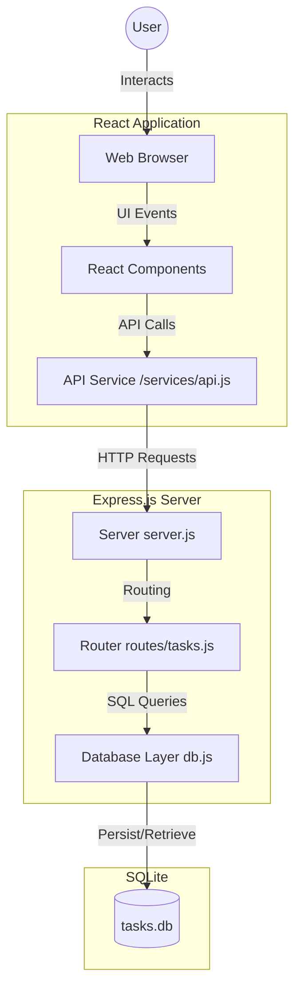
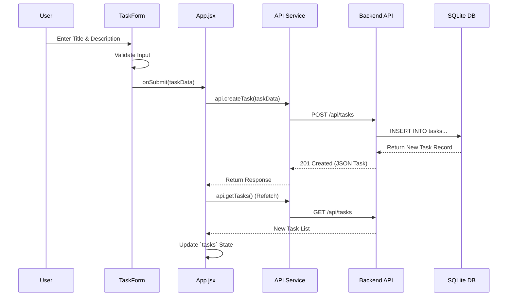

# Technical Handoff: Task Management System

## 1. Architecture Overview
The system follows a classic client-server architecture with a clear separation of concerns.

### System Diagram

### Component Hierarchy
- **App.jsx**: Root entry managing global state and routing.
- **TaskForm.jsx**: Input component for task creation.
- **TaskList.jsx**: Grid container for task display.
- **TaskCard.jsx**: Functional unit for individual task actions (Delete, Toggle).
- **FilterBar.jsx**: State controller for view filtering.

## 2. API Communication
The frontend communicates with an Express backend via RESTful endpoints.

### Sequence Flow (Create Task)

## 3. Code Quality & Security
- **Strengths**: Clean React hooks implementation, modern Tailwind CSS styling.
- **Security**: Prepared statements in SQLite for SQLi protection.
- **Recommendations**: Restrict CORS origins, move API URLs to environment variables, and implement XSS sanitization.
